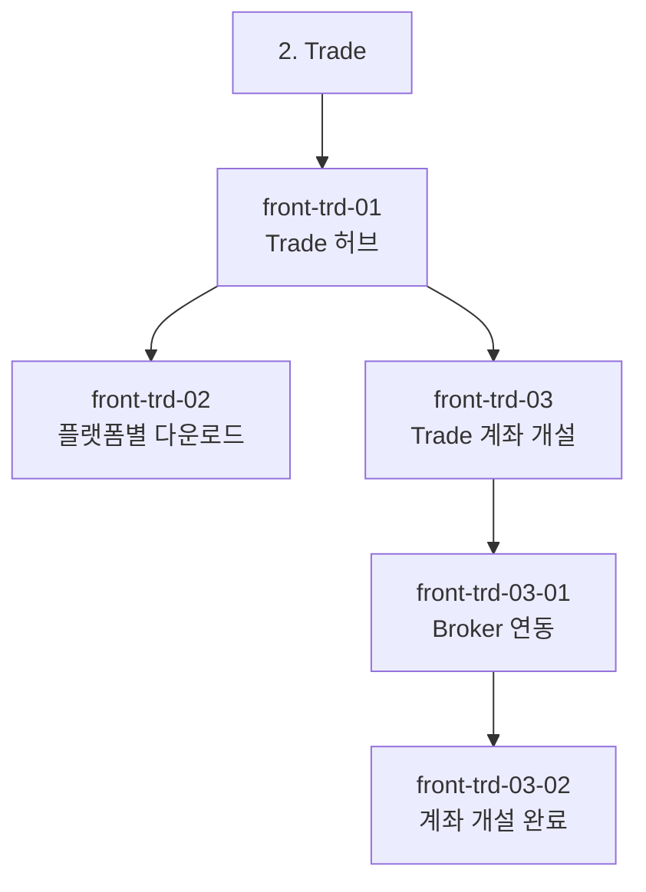
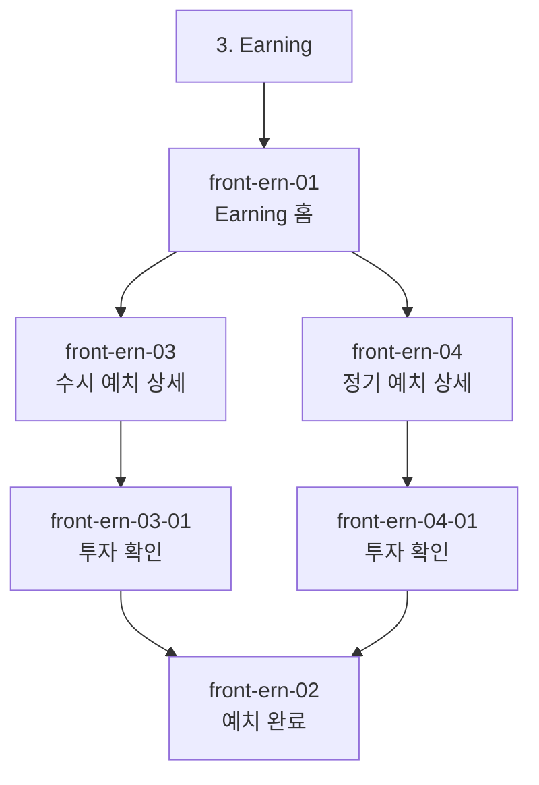
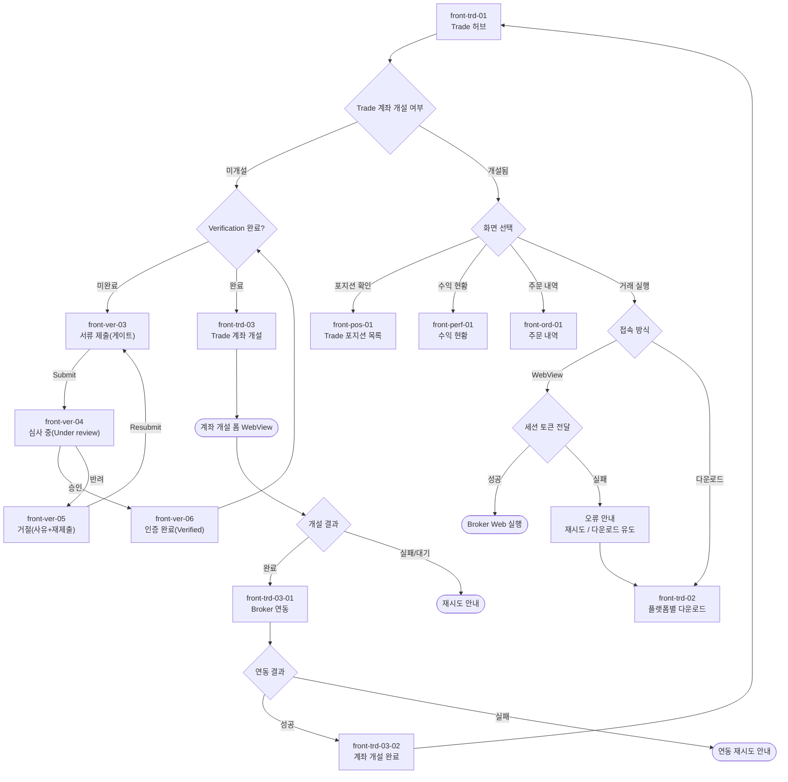
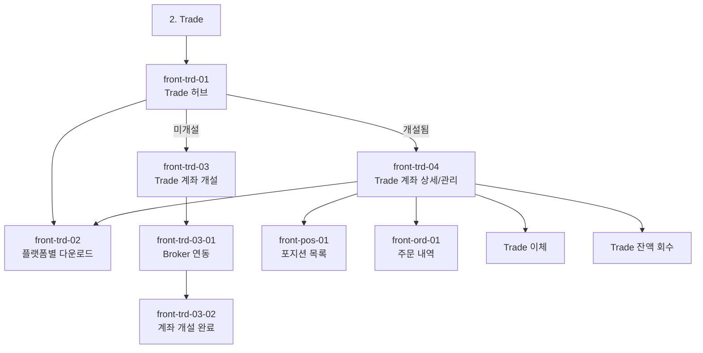
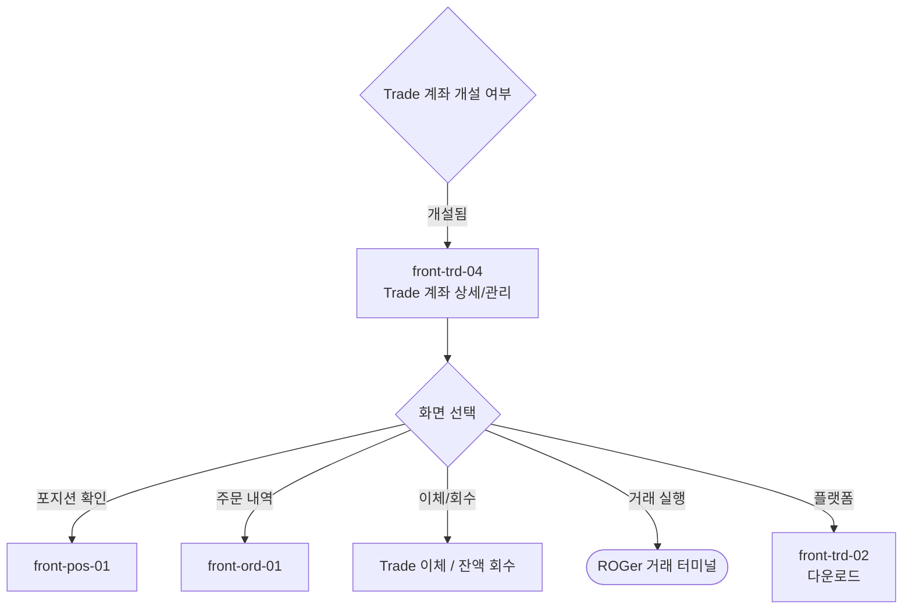
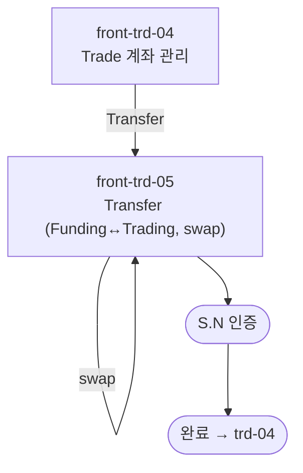
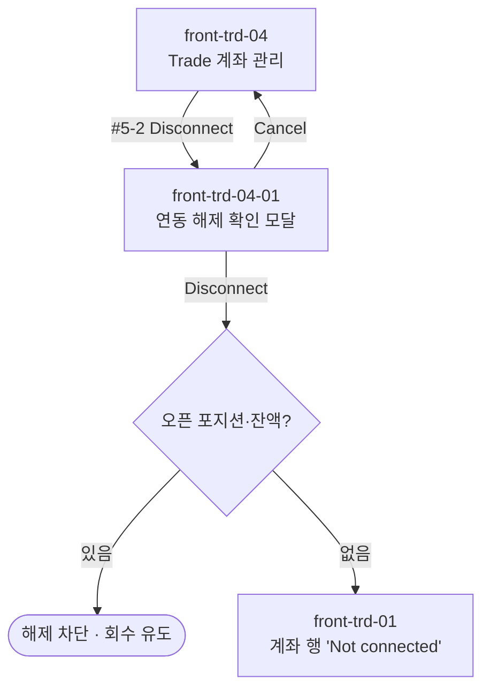
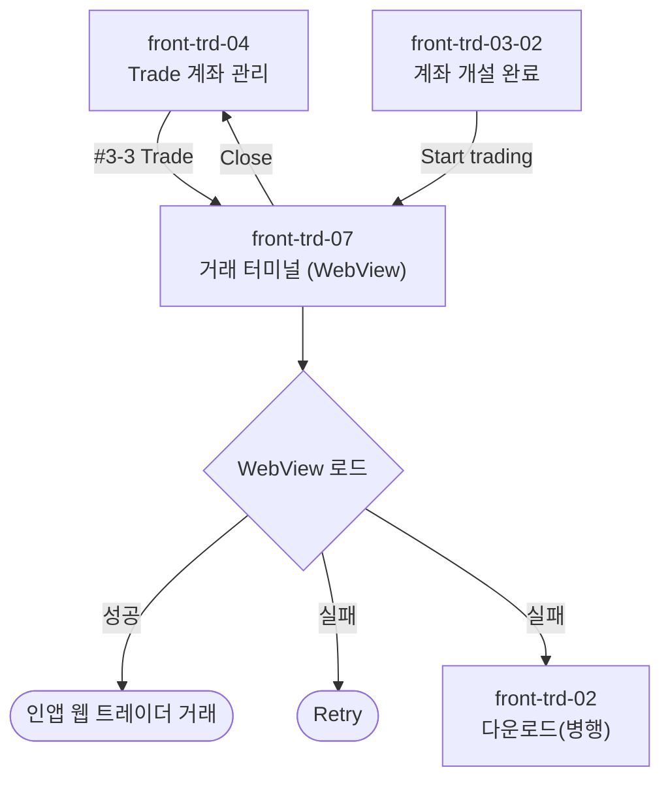
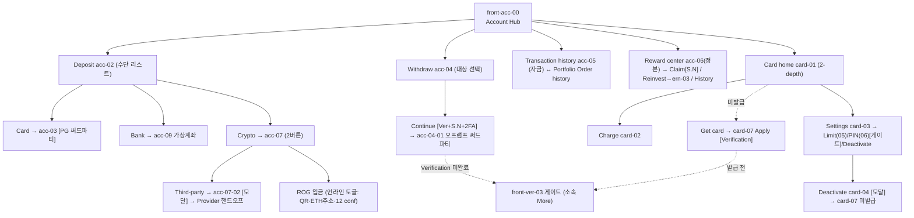
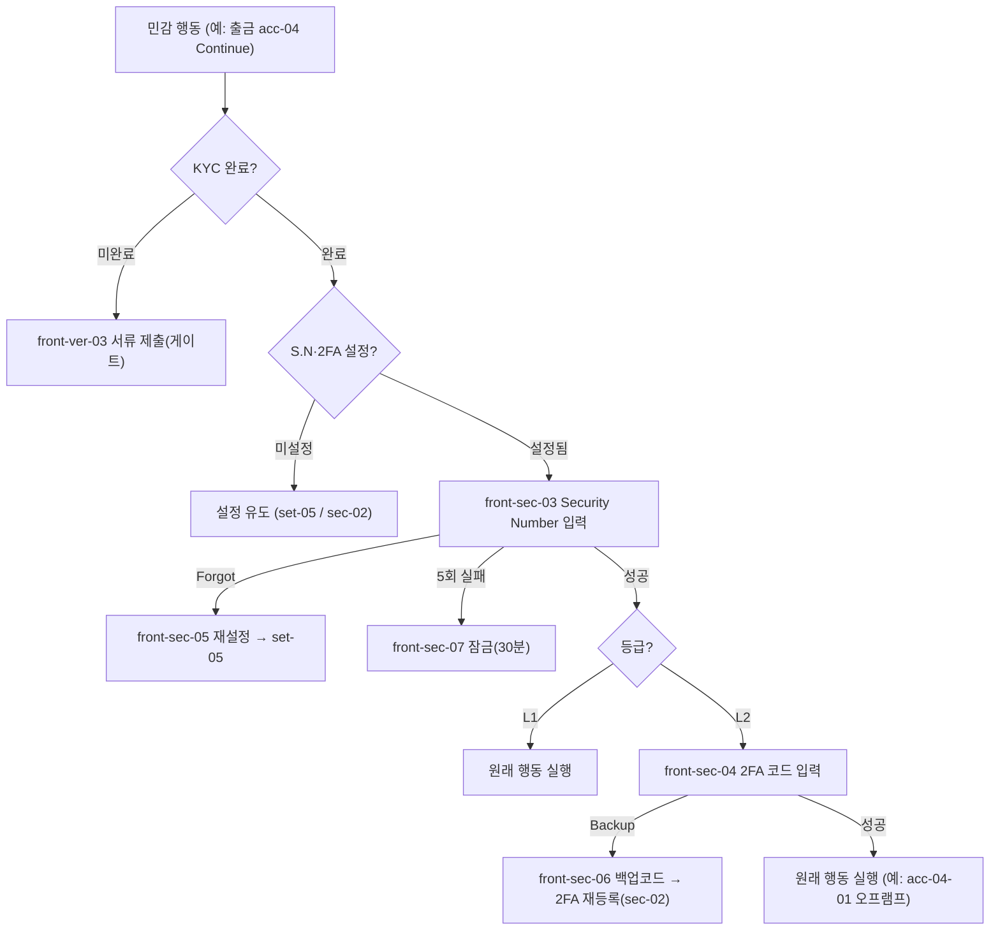

# ROGer · IA/유저플로우 수정사항 (화면설계 기준)

화면설계(11화면)와 1:1 대조해, **노션의 IA/유저플로우를 화면에 맞춰** 보완할 항목입니다.
아래 mermaid 블록을 노션 해당 다이어그램에 **그대로 교체/추가**하면 됩니다.

> 참고: 본 에이전트의 Notion 연결은 giraffeailabs 워크스페이스 편집 권한이 없어 직접 반영이 불가합니다(읽기만 가능). 권한을 연결해 주시면 직접 반영하겠습니다.

---

## ① Trade 메뉴 트리 — 라벨 1곳 변경
`MT-5 연동` → **`Broker 연동`** (확정사항 "MT-5 워딩 → 전체 Broker" 정합)

## ② Earning 메뉴 트리 — front-ern-02(예치 완료) 추가
화면엔 ern-02가 있으나 트리에 누락 → 추가

## ③ Flow 7 (Trade 트레이딩) — Verification 게이트 + 주문내역(ord-01) + Broker 라벨
화면 정합: 계좌개설 전 Verification(스테퍼에 반영) · trd-01 Quick links의 Orders(ord-01) · Broker 워딩

## ④ Flow 21 (Trade 계좌 개설) — Broker 라벨
`trd03_01["front-trd-03-01 MT-5 연동"]` → **`Broker 연동`** 으로 변경 (나머지 동일)

## ⑤ (선택) Flow 3 (어닝 예치) — ern-02 다음 액션 정합
- 현재 화면 ern-02 다음 액션 = **View position → front-pos-03(방금 예치 상세)** + Back to Earning(ern-01)
- 플로우는 ern-02 → pos-02(목록)·pos-03·ern-01.
- 택1: (a) 화면에 "어닝 포지션 목록(pos-02)" 버튼 추가, 또는 (b) 플로우에서 ern-02→pos-02 제거.

## ⑥ front-trd-04 신설 — Trade 계좌 상세/관리 (개설 상태 진입점)
배경: 기존엔 "개설된 Trade 계좌"의 정본 진입 화면이 없어 trd-01의 계좌 행이 개설 화면(trd-03)으로 잘못 연결됨. 개설 상태 진입점으로 **front-trd-04(Trade 계좌 상세/관리)** 를 신설(P0). 계좌 요약(서버·로그인·연결상태·Equity) + 이체/잔액회수/포지션/거래 + 최근주문 + 관리(다운로드·연동해제)를 모은 허브.

- **IA 트리(② Trade)에 trd-04 추가** — `trd-01 → trd-04`(계좌 개설된 경우). 미개설은 기존대로 `trd-01 → trd-03`.

- **Flow 7(③) 개설됨 분기 정합** — 기존 `acctCheck -- 개설됨 --> viewType{화면 선택}`을 **계좌 허브 trd-04 경유**로 변경:

> 참고: Trade 이체 / 잔액 회수는 IA엔 존재(별도 화면)하나 본 와이어프레임(11→12화면)엔 미설계. trd-04에서 진입점만 정의.

## ⑦ 계좌 개설 = 네이티브(ROGer가 FX 브로커사) — WebView 표현 정정
ROGer가 **FX 브로커사 본인**이므로, 계좌 개설은 외부 "Broker WebView"가 아니라 **ROGer 앱 내 네이티브 폼**으로 진행. 관련 화면/플로우 표현을 정정:

- **front-trd-03 (계좌 개설)**: 외부 WebView 폼 → **네이티브 FX 계좌 개설 폼**(Account type · Base currency · Leverage · **Trading password**(사용자 직접 설정) · Risk/Terms 동의 → Create account). 거래 터미널 비밀번호는 이 폼에서 설정(앱 로그인 비번과 별개).
- **front-trd-03-01 (Connect 단계)**: 'Broker 연동'(외부 자격 증명 연동) → **'계좌 활성화 · 서버 프로비저닝'**. 서버 프로비저닝 → 자격 증명(Login ID) 발급 → 계좌 활성화. (화면 ID는 유지, 라벨/문구만 정정)
- **front-trd-03-02 / trd-04 / 거래 실행**: 'Launch Broker / Broker WebView' → **'Start trading / ROGer 거래 터미널(웹·다운로드 앱)'**.
- IA 트리 라벨: `front-trd-03-01` 명칭 `Broker Link` → **`Account Activation`**.

> 거래계좌 비밀번호 설정 위치 = front-trd-03 개설 폼(4-4 Trading password). 활성화(trd-03-01)에서는 발급 항목(Server·Login ID)만 표시하고 비밀번호는 미표시.

## ⑧ Trade 자금 이동 화면 신설 + 거래 실행 = 외부 앱 전용 (2026-06-09 확정)
**(1) 통합 Transfer 화면 신설** — trd-04 Quick actions의 **Transfer 단일 진입**(Recall은 별도 화면 없이 swap으로 통합). 거래소 표준(From/To + swap) UI:
- **front-trd-05 · Transfer (Funding ↔ Trading)**: From/To(Funding=예수금 ↔ Trading=거래계좌) + **가운데 swap 버튼으로 방향 전환** · Asset(USDT) · Amount(Max=방향별 가용액) · Confirm → **[S.N] 인증**.
  - Funding→Trading = 증거금 충전, Trading→Funding = 회수(Max=Free Margin, 점유 증거금 제외).
- (※ 기존 trd-06 Recall 별도 화면은 **삭제** — 한 화면 swap으로 양방향 처리.)

**(2) 거래 실행 = 인앱 WebView 자체 거래로 통일 (2026-06-10 결정 반전)** — 종전 "외부 앱 전용 · 인앱 WebView 미제공"을 뒤집어, 실제 매매를 **ROGer 앱 안의 인앱 WebView 웹 트레이더**에서 실행하도록 통일. 별도 화면 **front-trd-07(거래 터미널, WebView)** 신설(아래 ⑪). 외부 **다운로드 앱(front-trd-02)은 병행 유지**(데스크톱/고급 사용자). 관련 진입점(trd-04 #3-3 Trade · trd-03-02 #2-2 Start trading)은 모두 **front-trd-07 진입**으로 연결.

**(3) trd-01 Trade 허브 정리** — **#2 Launch Broker(Start trading) CTA 삭제**(거래는 외부 앱 전용이라 허브 내 실행 버튼 제거). **Trade account 행을 Equity 카드 바로 아래(#2)로 승격** → 계좌 관리(trd-04) 진입을 상단에 노출. 허브 구성: 1 Equity · 2 Trade account · 3 Quick links · 4 Open positions.

> IA 트리(② Trade): trd-04 하위에 **trd-05(Transfer 단일)** 추가(trd-06 삭제). 유저플로우: 자금 이동 = 단일 Transfer + swap + S.N 게이트. 거래 실행 노드는 "외부 앱(다운로드)"으로 단일화.

## ⑨ Leverage 옵션 (범용 FX 기준)
front-trd-03 #4-3 레버리지 선택지를 범용 FX 마진 기준으로: **1:50 / 1:100(기본) / 1:200 / 1:500**. 규제 관할은 1:30 등으로 캡, 미지원 옵션은 비활성/숨김.

## ⑩ front-trd-04-01 신설 — 연동 해제 확인 모달 (2026-06-10)
trd-04 #5-2 Disconnect는 파괴적(되돌릴 수 없음) 액션이라, 바로 처리하지 않고 **확인 모달 화면 front-trd-04-01**을 신설해 한 단계 게이트를 둠.

- **front-trd-04-01 · Disconnect 확인 모달**: 배경 trd-04 dim · 해제 대상 계좌(Server·Login ID) + 되돌릴 수 없음 경고 + 선결 안내(오픈 포지션·잔액 청산/회수, 재연동=개설 재진입). 액션 = Cancel(→ trd-04) / Disconnect(→ trd-01 "Not connected").
- **IA 트리(② Trade)**: trd-04 하위에 **trd-04-01(모달)** 추가.

> 규칙: **새 화면(모달 포함)을 추가할 때마다 IA 트리·유저플로우에 항상 함께 반영**(누락 금지).

## ⑪ front-trd-07 신설 — 거래 터미널 (인앱 WebView) (2026-06-10)
거래 실행을 인앱 WebView로 통일하면서, ROGer 자체 웹 트레이더를 임베드하는 **front-trd-07** 신설.

- **front-trd-07 · Trade terminal (WebView)**: 상단 바(Close→trd-04 · Reload) + **MT5 웹 터미널을 인앱 WebView로 임베드(현 화면은 더미 placeholder)** + 세션/상태(세션 토큰 자동 로그인 · Demo 배지). 진입 = 세션 토큰 자동 로그인. 로딩(Connecting…)·에러(Couldn't load → Retry / trd-02 다운로드)·세션 만료 재인증을 예외로 명세.
  - **⚠ 웹뷰(MT5) 제공 여부·방식은 MetaQuotes(메타쿼츠)와의 계약에 따라 결정** — 계약 미확정 시 front-trd-02 다운로드 앱으로 대체.
- **진입점**: trd-04 #3-3 Trade(**정본**), trd-03-02 #2-2 Start trading(동일 공통 "거래 터미널 진입" 동작 재사용) → 모두 trd-07.
- **상태/규칙**: WebView = MT5 웹 터미널(더미) · 로드 URL 계약·구현 시 확정 · 세션 토큰 자동 로그인(URL 노출 금지) · 비활성 15분(금융권 평균) 후 만료 · WebView 내 체결은 앱(Equity·Recent orders·포지션)에 동기화 · Demo는 데모 계좌(데모 서버)로 로드 · Loading/Error(Retry·다운로드) 상태 명세(#2-1).
- **IA 트리(② Trade)**: trd-04(또는 trd-03-02) → trd-07. trd-02(다운로드)는 병행 분기로 유지.

---

## ⑫ Account GNB 정리 (AS-IS → TO-BE) (2026-06-12)
Account 화면설계서 착수 전, 기존 GNB와의 중복·문서 불일치를 정리한 확정안. 상세는 `ROGer_Account_AS-IS_TO-BE_260612.md`.

- **GNB**: 5탭 단일화(Portfolio·Trade·Earning·Account·More). 킥오프 4탭(Invest)은 폐기.
- **거래/주문 내역 분리**: Account = **Transaction history**(자금: 입금·출금·예치/환매·리워드·카드결제) / Portfolio = **Order history**(매매). 상호 cross-link.
- **리워드 정본 = Account 리워드 센터**(어닝+페이백+레퍼럴 통합 수령). Earning은 적립 표시·링크, Portfolio Today's Reward는 요약 위젯 → 센터로 이동.
- **자금 이동 동사 고정**: Account = **Deposit/Withdraw**(외부↔예수금) · Trade = **Transfer**(예수금↔거래계좌) · Earning = **Invest/Redeem**(예수금↔어닝). "Deposit" 단어 충돌 회피.
- **Verification/신원**: 소속 = More(ver·idn), Account·Card는 게이트(front-ver-03) **호출만**.
- **Card**: Account GNB **하위(2-depth)** `front-card-XX`. 별도 GNB 아님.
- **ID 규칙**: 소문자 `front-acc-XX` / `front-card-XX`.

> 갱신(2026-06-15): 입출금 전면 **써드파티 핸드오프**. Deposit 리스트형 전환 · Crypto는 **Third-party 모달(acc-07-02) + ROG 인라인 토글** · Withdraw 오프램프(acc-04-01). 금액 입력·실행은 Provider/PG/오프램프 화면.
> 교차 정합: Earning 카피 **Invest/Redeem** 유지. Portfolio "Order history"·"Today's Reward→리워드 센터" 링크 배선 완료.

---

## IA 킥오프 문서 (별건, 중요)
킥오프 문서가 **GNB 4개 탭(Portfolio/Invest/Account/More) · Invest 5화면 · 총 67화면**으로 되어 있어, 확정된 **5개 탭(Portfolio/Trade/Earning/Account/More) · Invest→Trade·Earning 이원화**와 불일치. 킥오프 문서를 5탭 기준으로 업데이트 권장. **→ ⑫에서 TO-BE 확정.**

---

## ⑬ 인증 게이트 (L1/L2) 표준 흐름 + 복구 — 2026-06-16
인증 정책(`ROGer_인증정책_260616`) 반영. 민감 행동 = **L1(Security Number 단일)** / **L2(Security Number + 2FA)**. 게이트 입력 화면 신설: sec-03(S.N)·sec-04(2FA), 복구 sec-05~07.

- **L2 적용**: 출금·ROG 출금·Security Number 변경·2FA 해제·회원 탈퇴. **L1**: 리워드 수령·CVV 조회·PIN 변경·계정정보 변경·예치/환매.
- **재인증 캐시(권장)**: 동일 세션 5분. **S.N 5회 실패 = 분실과 동일 처리
## ⑭ front-avw-01 Asset 카드 UX 정리 (2026-06-22)

- **Asset 카드 헤더 링크 라벨**: `View all ›` → **`Detail ›`** (이동 대상 동일 = front-pos-00 Asset Hub). pos-00의 Detail 표기와 통일. *Recent activity의 `View all ›`는 목록 이동이므로 유지.*
- **Asset 행 색상 사각형(범례) 제거**: 비중%·도넛 차트 제거 후 의미가 없어진 Cash/Earning/Broker/ROG 앞 색네모 삭제. 행 그리드 `10px 1fr 80px` → `1fr 80px` (자산명 + 금액 2열).
- **잔액 마스킹 범위 확장**: Total Value 우상단 눈(eye) 토글 클릭 시 **Total Value + 변동액 + Asset 4행 금액**을 함께 `•••••` 마스킹(toggleMask 적용 범위 .card → section). 넘버링 1:1 영향 없음(4-1~4-5 유지).

## ⑮ front-pos-00 카드 구조 복구 (2026-06-22)

- **버그**: Broker FX행 숨김 편집이 ① Broker(#4) 카드 통째 삭제 ② Earning(#3) 카드 구조 파손(고아 `
`→phone-content 조기 종료, ROG·GNB가 폰 밖으로 이탈) ③ desc #4는 옛 FX 포지션 설명 잔존 → **UI 1·2·3·5 vs desc 1·2·3·4·5 (1:1 위반)**.
- **복구**: Earning #3 카드 정상화(Flexible $4,000 + Fixed-term $2,000 = $6,000), **Broker #4 카드 재삽입**(Trade Account · Equity $1,500, FX 포지션 미노출, Detail → pos-01), desc #4를 'Broker 운용 금액(Equity) 요약'으로 재작성.
- **순서/정합**: Total Value(1) → Cash(2) → Earning(3) → Broker(4) → ROG(5). 합계 $4,000+$6,000+$1,500+$500=**$12,000** (avw-01 일치). cal-tag·desc 모두 1~5 1:1.

## ⑯ front-pos-00 각 금액 '구성' 명세 추가 (2026-06-22)

각 콜아웃 desc에 표기 금액이 무엇을 포함하는지 명시:
- **#1 Total Value**: Cash $4,000 + Earning $6,000(원금+리워드) + Broker $1,500(Equity) + ROG $500(평가액) = $12,000. 하단 TODAY P&L=당일 손익(어닝 리워드+트레이딩 손익), ACTIVE=활성 포지션 수.
- **#2 Cash**: 운용·투자 전 가용 현금(USD), 리워드·손익 미포함.
- **#3 Earning**: 각 행 = 원금 + 누적 적립 리워드의 평가액(Flexible $4,000 / Fixed-term $2,000). 오늘 적립 리워드는 당일 증가분으로 평가액에 포함.
- **#4 Broker**: Equity = 예치 증거금(원금) + 미실현 손익. 출금 가능액(Free Margin)과 상이할 수 있음.
- **#5 ROG**: 평가액 = 보유 수량 × 현재 시세(USD), 원금 개념 없음.
